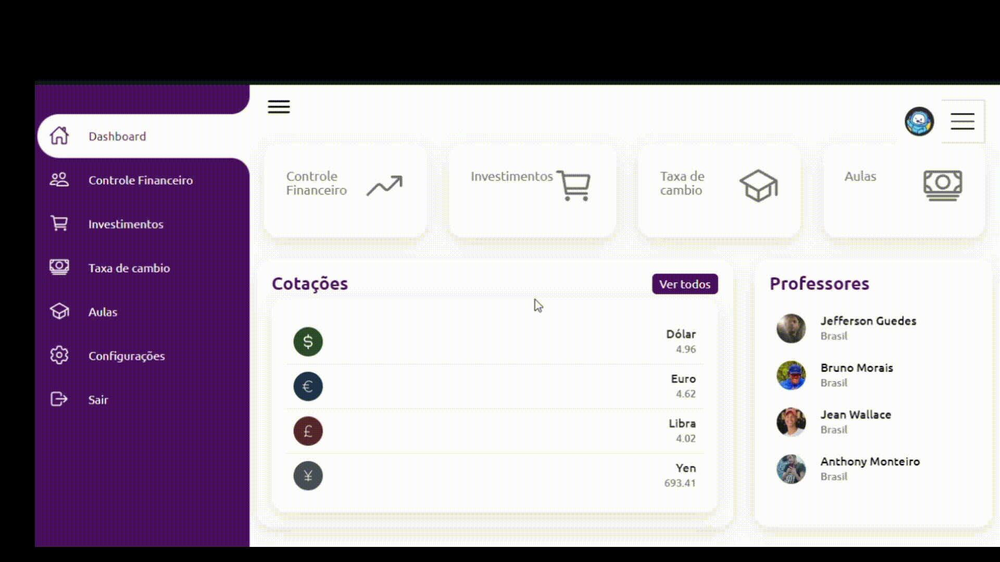

<h1 align="center">TCC ETEC Jardim Ângela</h1>

Esse projeto foi iniciado em Junho de 2022, como um trabalho de conclusão de curso (TCC) em nossa formação como Ánalista Técnicos em Desenvolvimento de Sistemas pela instituição ETEC Jardim Ângela.

## O que é?

No mundo atual, é fundamental que os indivíduos adquiram conhecimentos sólidos em educação financeira, a fim de tomarem decisões financeiras bem informadas e alcançarem a estabilidade econômica. 
Com base nessa necessidade, minha plataforma de estudos foi desenvolvida com o intuito de preencher essa lacuna educacional, fornecendo conteúdo abrangente e de qualidade sobre educação financeira. Ela oferece um ambiente de aprendizado interativo, que engaja os usuários por meio de diversos recursos, como vídeos, infográficos, questionários e estudos de caso.

Identificamos que era necessário um sistema que:

- Comunicação entre o aluno e professor de forma simples;
- Progresso do aluno no desenvolvimento do curso
- Seja capaz de armazenar, consultar e gerir seus clientes com CRUD;

Depois de discussões sobre como resolveriamos essas necessidades, fizemos os prímeiros protótipos. Confira as imagens:

- [O primeiro protótipo da parte de login e cadastro](https://www.figma.com/file/59vTxkc2BQA12cibMyUNdF/login-youtube-(Copy)?type=design&node-id=0%3A1&t=gJyvSSQrKCz2CfGM-1))

Quando decidido por onde seguiriamos, iniciamos o desenvolvimento do projeto. Você pode conferir o resultado na demonstração a seguir.

## Demonstração
Cadastro e login de úsuario:
- Validação com Javascript e PHP, com session e niveis de úsuarios

  <strong>Login e cadastro</strong>  
  

Dashboard:
- Após o login o "Úsuario comum", entra na plataforma.

  <strong>Dashboard</strong>  
  

## Quais tecnologias foram usadas?

- [HTML](https://developer.mozilla.org/pt-BR/docs/Web/HTML); [CSS](https://developer.mozilla.org/pt-BR/docs/Web/CSS); [JavaScript](https://developer.mozilla.org/pt-BR/docs/Web/JavaScript)
- [Bootstrap](https://getbootstrap.com/); [Bootstrap Notify](https://github.com/mouse0270/bootstrap-notify) 
- [PHP 7.x](https://www.php.net/) e [MySQL](https://www.mysql.com/)

## Como executar o projeto?

Caso queira apenas testar, considere usar o [Laragon](https://laragon.org/) como gerenciador do ambiente. Ele por padrão executará um servidor apache e um servidor mysql.

Com o Laragon instalado, inicie e clique no botão `root` no canto direito da tela. O seu explorador de arquivos será aberto dentro do diretório `www`, agora arraste o diretório `sistema` desse repositório para dentro do `www`.

Volte ao Laragon e inicie o servidor Apache e o MySQL clicando no botão `iniciar tudo` ou `start all`.

Depois, crie um banco de dados MySQL no botão correspondente com as configurações padrão e nomeie como `mamaezona`. Abra um cliente SQL, como HeidiSQL ou DBeaver, ambas integradas ao Laragon e importe o arquivo `.sql` de [`model/sql/redme`](./sistema/php/database.sql). Execute esse arquivo para criação de toda a estrutura do banco de dados e alguns dados de teste.

Com o banco de dados criado, acesse o sistema.

## Nosso grupo

- [Jefferson Guedes](https://github.com/JGueedeS)
- [Jean Walacce](https://github.com/Wallaceehjean)
- [Bruno Morais](https://github.com/BRUNOMORAIS089)
- [Anthony Monteiro](https://github.com/TonhaoGameplays)

## Aviso

1. Esse projeto não está 100% completo, portanto não use-o em produção sem ter feito uma boa revisão.

